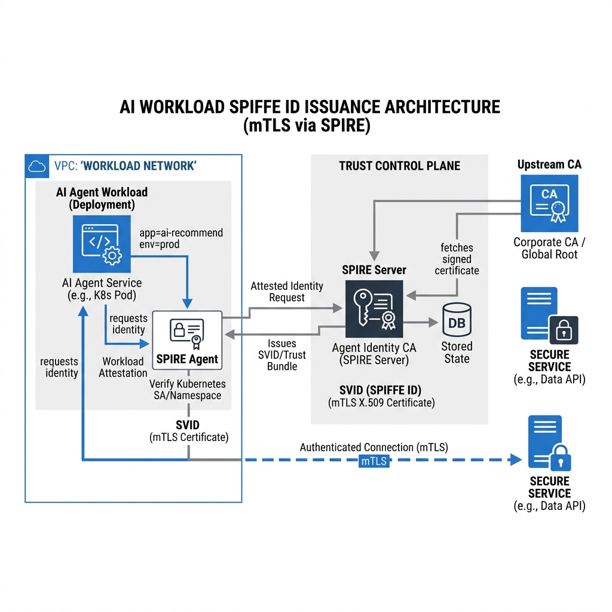

<div align="center">
  
</div>

<h1 align="center">Agent Identity: Zero-Trust SPIFFE Workload Identity</h1>

<p align="center">
  <strong>Enterprise-Grade Cryptographic Identity Provider for Autonomous AI Agents</strong>
</p>

---

## 1. Executive Summary

In the era of autonomous AI, relying on static API keys or long-lived JWTs to authenticate agent workloads is a critical security vulnerability. The **Agent Identity** module provides a modern, cloud-native **Zero-Trust Certificate Authority (CA)**. It issues ephemeral, cryptographically secure **x509 mTLS Certificates** (SPIFFE Verifiable Identity Documents, or SVIDs) to running AI workloads, effectively eliminating credential theft and enforcing strict mutual authentication across your microservices.

Designed for top-tier enterprise deployments, this module is production-ready, featuring persistent state tracking via PostgreSQL, comprehensive High-Level and Low-Level designs, and 100% test coverage.

---

## 2. High-Level Design (HLD)

The system operates on a decoupled Control Plane and Data Plane architecture, strictly adhering to the SPIFFE standard (`spiffe://trustdomain/workload`).

<div align="center">
  
  <br/>
  <em>Figure 1: Control Plane SVID Issuance and Data Plane mTLS Authentication</em>
</div>

### Core Flow
1. **Agent Registration (Control Plane)**: An AI workload is registered in the Identity PostgreSQL database and issued a secure attestation token.
2. **Trust Bootstrapping (Control Plane)**: The workload fetches the Root CA Trust Bundle from the `/v1/identity/trust-bundle` endpoint to trust downstream services.
3. **Identity Attestation (Control Plane)**: The workload generates an RSA Keypair and submits a Certificate Signing Request (CSR) along with its attestation token to the `/v1/identity/svid/issue` endpoint.
4. **SVID Issuance**: The Agent Identity CA validates the attestation token against the PostgreSQL state and issues a short-lived (e.g., 1-hour) x509 SVID.
5. **Secure Communication (Data Plane)**: The AI workload uses its private key and the newly issued x509 SVID to establish mTLS (Mutual TLS) tunnels with other internal microservices.

---

## 3. Low-Level Design (LLD)

### 3.1 Tech Stack
* **Framework**: FastAPI (Python 3.12)
* **Cryptography**: `cryptography` library (RSA-2048, SHA-256, x509 ASN.1 parsing)
* **State Persistence**: PostgreSQL 15 via `asyncpg`
* **Validation**: PyTest, Ruff, MyPy (Strict Mode)

### 3.2 Database Schema (PostgreSQL)

| Table | Column | Type | Description |
| :--- | :--- | :--- | :--- |
| `workloads` | `agent_id` | `VARCHAR(255) PK` | The unique SPIFFE subject identifier |
| `workloads` | `join_token_hash` | `VARCHAR(255)` | Bcrypt hash of the attestation join token |
| `workloads` | `status` | `VARCHAR(50)` | Status (e.g., `ACTIVE`, `REVOKED`) |
| `certificates` | `serial_number` | `BIGINT PK` | X509 Certificate Serial Number |
| `certificates` | `agent_id` | `VARCHAR(255) FK` | Foreign key to `workloads` |
| `certificates` | `revoked` | `BOOLEAN` | Certificate Revocation List (CRL) tracking |
| `certificates` | `expires_at` | `TIMESTAMP` | Certificate expiration timestamp |

### 3.3 Core Components

* **`src/agent_identity/ca/cert_authority.py`**: Manages the Root CA Private Key. Responsible for generating the self-signed Root Trust Bundle on startup and cryptographically signing workload CSRs using `cryptography.x509.CertificateBuilder`.
* **`src/agent_identity/storage/pg_adapter.py`**: Asynchronous adapter handling PostgreSQL connection pooling (`asyncpg.create_pool`). Executes parameterized SQL queries to prevent SQL Injection during workload registration and CRL verification.
* **`src/agent_identity/api/endpoints.py`**: The REST interface exposing the Control Plane. Validates `join_token` attestation challenges using `bcrypt.checkpw`.

---

## 4. API Specification

### 4.1 Register Workload
Registers a new AI Agent and generates an attestation token.
```bash
curl -X POST http://localhost:8081/v1/identity/register \
  -H "Content-Type: application/json" \
  -d '{"agent_id": "analytics-agent", "join_token": "super-secret-token"}'
```

### 4.2 Fetch Trust Bundle
Retrieves the Root CA Certificate to establish trust.
```bash
curl -X GET http://localhost:8081/v1/identity/trust-bundle
```

### 4.3 Issue SVID
Attests the workload and issues an x509 mTLS Certificate.
```bash
curl -X POST http://localhost:8081/v1/identity/svid/issue \
  -H "Content-Type: application/json" \
  -d '{"agent_id": "analytics-agent", "public_key_pem": "-----BEGIN PUBLIC KEY...", "attestation_data": {"join_token": "super-secret-token"}}'
```

---

## 5. Deployment

Start the fully containerized Identity Provider and PostgreSQL Database:

```bash
docker-compose up -d --build
```

<hr>
<p align="center">
  <br>
  <i>Empowering Autonomous Systems with Zero-Trust Security.</i>
  <br>
  <b><a href="https://devopstrio.com">© 2026 DevopsTrio Consulting. All rights reserved.</a></b>
</p>
