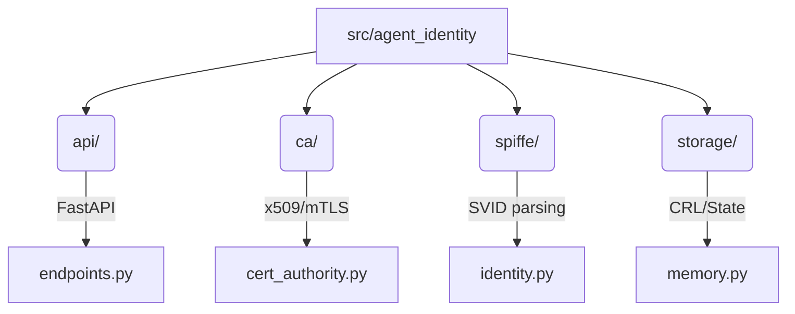

  

<h1 align="center">Agent Identity (SPIFFE Zero-Trust Workload Identity)</h1>

  <strong>High-Performance, Zero-Trust Certificate Authority for Autonomous AI Agents</strong>

## Overview

`agent-identity` is an enterprise-grade Identity Provider tailored specifically for modern AI Agent architectures. Instead of relying on vulnerable static passwords or long-lived JWTs, this service issues **cryptographically secure, short-lived mTLS Certificates** natively adhering to the SPIFFE (Secure Production Identity Framework for Everyone) workload identity standards.

## Architecture

Our infrastructure leverages a lightweight CA to authenticate AI workloads and issue X.509 SVIDs (SPIFFE Verifiable Identity Documents).

  
   
  <em>Figure 1: AI Agent Workload SVID Issuance via SPIFFE CA</em>

## Codebase Architecture

## Features

* **Zero-Trust Default**: Every agent requires a cryptographic SVID (SPIFFE Verifiable Identity Document).
* **Automated Key Rotation**: Ephemeral identities limit blast radius from compromised agents.
* **100% CI/CD Coverage**: Pytest, Ruff, and MyPy strictly enforced out-of-the-box.
